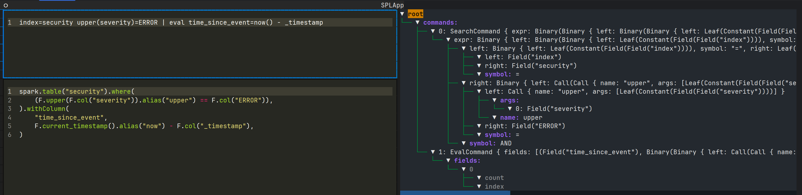

# Overview

`spl_transpiler` is a Rust + Python port of [Databricks Labs'
`spl_transpiler`](https://github.com/databrickslabs/transpiler).
The goal is to provide a high-performance, highly portable, convenient tool for adapting common SPL code into PySpark
code when possible, making it easy to migrate from Splunk to other data platforms for log processing.

# Installation

```pip install spl_transpiler```

# Usage

```python
from spl_transpiler import convert_spl_to_pyspark

print(convert_spl_to_pyspark(r"""multisearch
[index=regionA | fields +country, orders]
[index=regionB | fields +country, orders]"""))

# spark.table("regionA").select(
#     F.col("country"),
#     F.col("orders"),
# ).unionByName(
#     spark.table("regionB").select(
#         F.col("country"),
#         F.col("orders"),
#     ),
#     allowMissingColumns=True,
# )

```

## Interactive CLI

For demonstration purposes and ease of use, an interactive CLI is also provided.

```bash
pip install spl_transpiler[cli]
python -m spl_transpiler
```



This provides an in-terminal user interface ([using `textual`](https://github.com/Textualize/textual)) where you can
type an SPL query and see the converted Pyspark code in real time, alongside a visual representation of how the
transpiler is understanding your query.

# Why?

Why transpile SPL into Spark?
Because a huge amount of domain knowledge is locked up in the Splunk ecosystem, but Splunk is not always the optimal
place to store and analyze data.
Transpiling existing queries can make it easier for analysts and analytics to migrate iteratively onto other platforms.
SPL is also a very laser-focused language for certain analytics, and in most cases it's far more concise than other
languages (PySpark _or_ SQL) at log processing tasks.
Therefore, it may be preferable to continue writing queries in SPL and use a transpiler layer to make that syntax viable
on various platforms.

Why rewrite the Databricks Lab transpiler?
A few reasons:

1. The original transpiler is written in Scala and assumes access to a Spark environment. That requires a JVM to execute
   and possibly a whole ecosystem of software (maybe even a running Spark cluster) to be available. This transpiler
   stands alone and compiles natively to any platform.
2. While Scala is a common language in the Spark ecosystem, Spark isn't the only ecosystem that would benefit from
   having an SPL transpiler. By providing a transpiler that's both easy to use in Python and directly linkable at a
   system level, it becomes easy to embed and adapt the transpiler for any other use case too.
3. Speed. Scala's plenty fast, to be honest, but Rust is mind-numbingly fast. This transpiler can parse SPL queries and
   generate equivalent Python code in a fraction of a millisecond. This makes it viable to treat the transpiler as a
   realtime component, for example embedding it in a UI and re-computing the converted results after every keystroke.
4. Maintainability. Rust's type system helps keep things unambiguous as data passes through parsers and converters, and
   built-in unit testing makes it easy to adapt and grow the transpiler without risk of breaking existing features.
   While Rust is undoubtedly a language with a learning curve, the resulting code is very hard to break without
   noticing. This makes it much easier to maintain than a similarly complicated system would be in Python.

# Contributing

This project is in early development.
While it parses most common SPL queries and can convert a non-trivial variety of queries to PySpark, it's extremely
limited and not yet ready for any serious usage.
However, it lays a solid foundation for the whole process and is modular enough to easily add incremental features to.

Ways to contribute:

- Add SPL queries and what the equivalent PySpark could would be. These test cases can drive development and prioritize
  the most commonly used features.

# Support Matrix

## Search Commands

A complete list of built-in Splunk commands is provided on
the [Splunk documentation page](https://docs.splunk.com/Documentation/SplunkCloud/latest/SearchReference/ListOfSearchCommands).

It is _not_ the goal of this transpiler to support every feature of every SPL command.
Splunk and Spark are two different platforms and not everything that is built in to Splunk makes sense to trivially
convert to Spark.
What's far more important is supporting most _queries_ (say, 90% of all queries), which only requires supporting a
reasonable number of the most commonly used commands.

For reference, however, here is a complete table of Splunk commands and the current and planned support status in this
transpiler.

Support status can be one of the following:

- `None`: This command will result in a syntax error in the SPL parser, and is completely unrecognized.
- `Parser`: This command can be parsed from SPL into a syntax tree, but cannot currently be rendered back as Pyspark
  code.
- `Partial`: This command can be parsed and rendered back to functional Pyspark code. Not all features may be supported.
- `Complete`: This command can be parsed and rendered back to functional Pyspark code. All intended features are
  supported. _This library is still early in its development, and commands might get marked as `Complete` while still
  having unknown bugs or limitations._

| Command            | Support | Target |
|--------------------|---------|--------|
| `abstract`         | None    |        |
| `accum`            | None    |        |
| `addcoltotals`     | None    |        |
| `addinfo`          | None    |        |
| `addtotals`        | Partial | Yes    |
| `analyzefields`    | None    |        |
| `anomalies`        | None    |        |
| `anomalousvalue`   | None    |        |
| `anomalydetection` | None    |        |
| `append`           | None    |        |
| `appendcols`       | None    |        |
| `appendpipe`       | None    |        |
| `arules`           | None    |        |
| `associate`        | None    |        |
| `autoregress`      | None    |        |
| `bin` (`bucket`)   | Partial | Yes    |
| `bucketdir`        | None    |        |
| `chart`            | None    | Yes    |
| `cluster`          | None    |        |
| `cofilter`         | None    |        |
| `collect`          | Parser  | Yes    |
| `concurrency`      | None    |        |
| `contingency`      | None    |        |
| `convert`          | Partial | Yes    |
| `correlate`        | None    |        |
| `datamodel`        | None    |        |
| `dbinspect`        | None    |        |
| `dedup`            | Parser  | Yes    |
| `delete`           | None    |        |
| `delta`            | None    |        |
| `diff`             | None    |        |
| `erex`             | None    |        |
| `eval`             | Partial | Yes    |
| `eventcount`       | None    |        |
| `eventstats`       | Partial | Yes    |
| `extract` (`kv`)   | None    |        |
| `fieldformat`      | None    |        |
| `fields`           | Partial | Yes    |
| `fieldsummary`     | None    |        |
| `filldown`         | None    |        |
| `fillnull`         | Parser  | Yes    |
| `findtypes`        | None    |        |
| `folderize`        | None    |        |
| `foreach`          | None    |        |
| `format`           | Parser  | Yes    |
| `from`             | None    |        |
| `gauge`            | None    |        |
| `gentimes`         | None    |        |
| `geom`             | None    |        |
| `geomfilter`       | None    |        |
| `geostats`         | None    |        |
| `head`             | Partial | Yes    |
| `highlight`        | None    |        |
| `history`          | None    |        |
| `iconify`          | None    |        |
| `inputcsv`         | None    |        |
| `inputlookup`      | Parser  | Yes    |
| `iplocation`       | None    |        |
| `join`             | Parser  | Yes    |
| `kmeans`           | None    |        |
| `kvform`           | None    |        |
| `loadjob`          | None    |        |
| `localize`         | None    |        |
| `localop`          | None    |        |
| `lookup`           | Parser  | Yes    |
| `makecontinuous`   | None    |        |
| `makemv`           | None    |        |
| `makeresults`      | Parser  | Yes    |
| `map`              | Parser  | Yes    |
| `mcollect`         | None    |        |
| `metadata`         | None    |        |
| `metasearch`       | None    |        |
| `meventcollect`    | None    |        |
| `mpreview`         | None    |        |
| `msearch`          | None    |        |
| `mstats`           | None    | Yes    |
| `multikv`          | None    |        |
| `multisearch`      | Partial | Yes    |
| `mvcombine`        | Parser  |        |
| `mvexpand`         | Parser  | Yes    |
| `nomv`             | None    |        |
| `outlier`          | None    |        |
| `outputcsv`        | None    |        |
| `outputlookup`     | None    |        |
| `outputtext`       | None    |        |
| `overlap`          | None    |        |
| `pivot`            | None    |        |
| `predict`          | None    |        |
| `rangemap`         | None    |        |
| `rare`             | None    | Yes    |
| `redistribute`     | None    |        |
| `regex`            | Partial | Yes    |
| `reltime`          | None    |        |
| `rename`           | Partial | Yes    |
| `replace`          | None    |        |
| `require`          | None    |        |
| `rest`             | None    |        |
| `return`           | Parser  | Yes    |
| `reverse`          | None    |        |
| `rex`              | Partial | Yes    |
| `rtorder`          | None    |        |
| `savedsearch`      | None    |        |
| `script` (`run`)   | None    |        |
| `scrub`            | None    |        |
| `search`           | Partial | Yes    |
| `searchtxn`        | None    |        |
| `selfjoin`         | None    |        |
| `sendalert`        | None    |        |
| `sendemail`        | None    |        |
| `set`              | None    |        |
| `setfields`        | None    |        |
| `sichart`          | None    |        |
| `sirare`           | None    |        |
| `sistats`          | None    |        |
| `sitimechart`      | None    |        |
| `sitop`            | None    |        |
| `sort`             | Partial | Yes    |
| `spath`            | None    |        |
| `stats`            | Partial | Yes    |
| `strcat`           | None    |        |
| `streamstats`      | Parser  | Yes    |
| `table`            | Partial | Yes    |
| `tags`             | None    |        |
| `tail`             | None    | Yes    |
| `timechart`        | None    |        |
| `timewrap`         | None    |        |
| `tojson`           | None    |        |
| `top`              | Partial | Yes    |
| `transaction`      | None    | Yes    |
| `transpose`        | None    |        |
| `trendline`        | None    |        |
| `tscollect`        | None    |        |
| `tstats`           | None    |        |
| `typeahead`        | None    |        |
| `typelearner`      | None    |        |
| `typer`            | None    |        |
| `union`            | None    |        |
| `uniq`             | None    |        |
| `untable`          | None    |        |
| `walklex`          | None    |        |
| `where`            | Partial | Yes    |
| `x11`              | None    |        |
| `xmlkv`            | None    |        |
| `xmlunescape`      | None    |        |
| `xpath`            | None    |        |
| `xyseries`         | None    |        |

## Functions

There are two primary kinds of
functions: [Evaluation functions](https://docs.splunk.com/Documentation/SplunkCloud/9.2.2406/SearchReference/CommonEvalFunctions#Function_list_by_category) (
primarily for use in `eval`)
and [Statistical and Charting functions](https://docs.splunk.com/Documentation/SplunkCloud/9.2.2406/SearchReference/CommonStatsFunctions#Alphabetical_list_of_functions) (
primarily for use in `stats`).

Like with commands, there are a lot of built-in functions and not all of them may map cleanly to Spark.
This transpiler intends to support most queries and will thus support the most common functions.
However, there is no goal at this time to support all Splunk functions.

| Category | Subcategory                 | Function                | Support | Target |
|----------|-----------------------------|-------------------------|---------|--------|
| Eval     | Bitwise                     | `bit_and`               | Yes     | Yes    |
| Eval     | Bitwise                     | `bit_or`                | Yes     | Yes    |
| Eval     | Bitwise                     | `bit_not`               | Yes     | Yes    |
| Eval     | Bitwise                     | `bit_xor`               | Yes     | Yes    |
| Eval     | Bitwise                     | `bit_shift_left`        | Yes     | Yes    |
| Eval     | Bitwise                     | `bit_shift_right`       | Yes     | Yes    |
| Eval     | Comparison and Conditional  | `case`                  | No      | Yes    |
| Eval     | Comparison and Conditional  | `cidrmatch`             | Yes*    | Yes    |
| Eval     | Comparison and Conditional  | `coalesce`              | Yes     | Yes    |
| Eval     | Comparison and Conditional  | `false`                 | Yes     | Yes    |
| Eval     | Comparison and Conditional  | `if`                    | Yes     | Yes    |
| Eval     | Comparison and Conditional  | `in`                    | Yes     | Yes    |
| Eval     | Comparison and Conditional  | `like`                  | Yes     | Yes    |
| Eval     | Comparison and Conditional  | `lookup`                | No      |        |
| Eval     | Comparison and Conditional  | `match`                 | Yes     | Yes    |
| Eval     | Comparison and Conditional  | `null`                  | Yes     | Yes    |
| Eval     | Comparison and Conditional  | `nullif`                | Yes     | Yes    |
| Eval     | Comparison and Conditional  | `searchmatch`           | No      |        |
| Eval     | Comparison and Conditional  | `true`                  | Yes     | Yes    |
| Eval     | Comparison and Conditional  | `validate`              | No      | Yes    |
| Eval     | Conversion                  | `ipmask`                | No      |        |
| Eval     | Conversion                  | `printf`                | No      |        |
| Eval     | Conversion                  | `tonumber`              | No      | Yes    |
| Eval     | Conversion                  | `tostring`              | No      | Yes    |
| Eval     | Cryptographic               | `md5`                   | Yes     | Yes    |
| Eval     | Cryptographic               | `sha1`                  | Yes     | Yes    |
| Eval     | Cryptographic               | `sha256`                | Yes     | Yes    |
| Eval     | Cryptographic               | `sha512`                | Yes     | Yes    |
| Eval     | Date and Time               | `now`                   | Yes     | Yes    |
| Eval     | Date and Time               | `relative_time`         | No      | Yes    |
| Eval     | Date and Time               | `strftime`              | Partial | Yes    |
| Eval     | Date and Time               | `strptime`              | No      | Yes    |
| Eval     | Date and Time               | `time`                  | Yes     | Yes    |
| Eval     | Informational               | `isbool`                | No      | No     |
| Eval     | Informational               | `isint`                 | No      | No     |
| Eval     | Informational               | `isnotnull`             | Yes     | Yes    |
| Eval     | Informational               | `isnull`                | Yes     | Yes    |
| Eval     | Informational               | `isnum`                 | No      | No     |
| Eval     | Informational               | `isstr`                 | No      | No     |
| Eval     | Informational               | `typeof`                | No      | No     |
| Eval     | JSON                        | `json_object`           | No      |        |
| Eval     | JSON                        | `json_append`           | No      |        |
| Eval     | JSON                        | `json_array`            | No      |        |
| Eval     | JSON                        | `json_array_to_mv`      | No      |        |
| Eval     | JSON                        | `json_extend`           | No      |        |
| Eval     | JSON                        | `json_extract`          | No      |        |
| Eval     | JSON                        | `json_extract_exact`    | No      |        |
| Eval     | JSON                        | `json_keys`             | No      |        |
| Eval     | JSON                        | `json_set`              | No      |        |
| Eval     | JSON                        | `json_set_exact`        | No      |        |
| Eval     | JSON                        | `json_valid`            | No      |        |
| Eval     | Mathematical                | `abs`                   | Yes     | Yes    |
| Eval     | Mathematical                | `ceiling` (`ceil`)      | Yes     | Yes    |
| Eval     | Mathematical                | `exact`                 | No      | Yes    |
| Eval     | Mathematical                | `exp`                   | Yes     | Yes    |
| Eval     | Mathematical                | `floor`                 | Yes     | Yes    |
| Eval     | Mathematical                | `ln`                    | Yes     | Yes    |
| Eval     | Mathematical                | `log`                   | Yes     | Yes    |
| Eval     | Mathematical                | `pi`                    | Yes     | Yes    |
| Eval     | Mathematical                | `pow`                   | Yes     | Yes    |
| Eval     | Mathematical                | `round`                 | Yes     | Yes    |
| Eval     | Mathematical                | `sigfig`                | No      |        |
| Eval     | Mathematical                | `sqrt`                  | Yes     | Yes    |
| Eval     | Mathematical                | `sum`                   | Yes     | Yes    |
| Eval     | Multivalue                  | `commands`              | No      |        |
| Eval     | Multivalue                  | `mvappend`              | Yes     | Yes    |
| Eval     | Multivalue                  | `mvcount`               | Yes     | Yes    |
| Eval     | Multivalue                  | `mvdedup`               | No      |        |
| Eval     | Multivalue                  | `mvfilter`              | No      | Yes    |
| Eval     | Multivalue                  | `mvfind`                | No      |        |
| Eval     | Multivalue                  | `mvindex`               | Yes     | Yes    |
| Eval     | Multivalue                  | `mvjoin`                | No      | Yes    |
| Eval     | Multivalue                  | `mvmap`                 | No      |        |
| Eval     | Multivalue                  | `mvrange`               | No      |        |
| Eval     | Multivalue                  | `mvsort`                | No      |        |
| Eval     | Multivalue                  | `mvzip`                 | No      |        |
| Eval     | Multivalue                  | `mv_to_json_array`      | No      |        |
| Eval     | Multivalue                  | `split`                 | Yes     | Yes    |
| Eval     | Statistical                 | `avg`                   | Yes     | Yes    |
| Eval     | Statistical                 | `max`                   | Partial | Yes    |
| Eval     | Statistical                 | `min`                   | Partial | Yes    |
| Eval     | Statistical                 | `random`                | Yes     | Yes    |
| Eval     | Text                        | `len`                   | Yes     | Yes    |
| Eval     | Text                        | `lower`                 | Yes     | Yes    |
| Eval     | Text                        | `ltrim`                 | Yes     | Yes    |
| Eval     | Text                        | `replace`               | Yes     | Yes    |
| Eval     | Text                        | `rtrim`                 | Yes     | Yes    |
| Eval     | Text                        | `spath`                 | No      |        |
| Eval     | Text                        | `substr`                | Yes     | Yes    |
| Eval     | Text                        | `trim`                  | Yes     | Yes    |
| Eval     | Text                        | `upper`                 | Yes     | Yes    |
| Eval     | Text                        | `urldecode`             | No      | Yes    |
| Eval     | Trigonometry and Hyperbolic | `acos`                  | Yes     | Yes    |
| Eval     | Trigonometry and Hyperbolic | `acosh`                 | Yes     | Yes    |
| Eval     | Trigonometry and Hyperbolic | `asin`                  | Yes     | Yes    |
| Eval     | Trigonometry and Hyperbolic | `asinh`                 | Yes     | Yes    |
| Eval     | Trigonometry and Hyperbolic | `atan`                  | Yes     | Yes    |
| Eval     | Trigonometry and Hyperbolic | `atan2`                 | Yes     | Yes    |
| Eval     | Trigonometry and Hyperbolic | `atanh`                 | Yes     | Yes    |
| Eval     | Trigonometry and Hyperbolic | `cos`                   | Yes     | Yes    |
| Eval     | Trigonometry and Hyperbolic | `cosh`                  | Yes     | Yes    |
| Eval     | Trigonometry and Hyperbolic | `hypot`                 | Yes     | Yes    |
| Eval     | Trigonometry and Hyperbolic | `sin`                   | Yes     | Yes    |
| Eval     | Trigonometry and Hyperbolic | `sinh`                  | Yes     | Yes    |
| Eval     | Trigonometry and Hyperbolic | `tan`                   | Yes     | Yes    |
| Eval     | Trigonometry and Hyperbolic | `tanh`                  | Yes     | Yes    |
| Stats    | Aggregate                   | `avg`                   | No      | Yes    |
| Stats    | Aggregate                   | `count`                 | Yes     | Yes    |
| Stats    | Aggregate                   | `distinct_count` (`dc`) | No      | Yes    |
| Stats    | Aggregate                   | `estdc`                 | No      |        |
| Stats    | Aggregate                   | `estdc_error`           | No      |        |
| Stats    | Aggregate                   | `exactperc`             | No      |        |
| Stats    | Aggregate                   | `max`                   | No      | Yes    |
| Stats    | Aggregate                   | `mean`                  | No      | Yes    |
| Stats    | Aggregate                   | `median`                | No      | Yes    |
| Stats    | Aggregate                   | `min`                   | No      | Yes    |
| Stats    | Aggregate                   | `mode`                  | No      | Yes    |
| Stats    | Aggregate                   | `percentile`            | No      | Yes    |
| Stats    | Aggregate                   | `range`                 | No      | Yes    |
| Stats    | Aggregate                   | `stdev`                 | No      | Yes    |
| Stats    | Aggregate                   | `stdevp`                | No      | Yes    |
| Stats    | Aggregate                   | `sum`                   | Yes     | Yes    |
| Stats    | Aggregate                   | `sumsq`                 | No      | Yes    |
| Stats    | Aggregate                   | `upperperc`             | No      | Yes    |
| Stats    | Aggregate                   | `var`                   | No      | Yes    |
| Stats    | Aggregate                   | `varp`                  | No      | Yes    |
| Stats    | Event order                 | `first`                 | No      |        |
| Stats    | Event order                 | `last`                  | No      |        |
| Stats    | Multivalue stats and chart  | `list`                  | No      |        |
| Stats    | Multivalue stats and chart  | `values`                | Yes     | Yes    |
| Stats    | Time                        | `earliest`              | Yes     | Yes    |
| Stats    | Time                        | `earliest_time`         | No      |        |
| Stats    | Time                        | `latest`                | Yes     | Yes    |
| Stats    | Time                        | `latest_time`           | No      |        |
| Stats    | Time                        | `per_day`               | No      |        |
| Stats    | Time                        | `per_hour`              | No      |        |
| Stats    | Time                        | `per_minute`            | No      |        |
| Stats    | Time                        | `per_second`            | No      |        |
| Stats    | Time                        | `rate`                  | No      |        |
| Stats    | Time                        | `rate_avg`              | No      |        |
| Stats    | Time                        | `rate_sum`              | No      |        |

\* Pyspark output depends on custom UDFs instead of native Spark functions. Some of these may be provided by this
package, some may be provided by Databricks Sirens.
